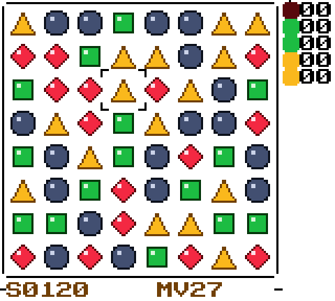

# gbforge

A declarative model for tile-based puzzle games that compiles to Game
Boy Color code at build time.

You declare the game's presentation and policy — modes and their
refill/shake rules, every animation timing, the UI overlays, the
title screen — in about forty lines of Python. gbforge turns that
into the C configuration tables a shared, hand-tuned runtime
consumes, and the result links into a ROM that runs on an 8-bit CPU
with 8KB of work RAM and bank-switched ROM.

It ships with the rest of the workbench: a headless emulator harness
that drives the ROM at the memory and pixel level, a pure-Python model
of the game engine that is checked against the C one over ten thousand
boards, and the macOS art tool that owns the game's tile and palette
source files directly.

## Why this exists

The Game Boy Color has no floating point, measures its budgets in
cycles per scanline, and silently drops VRAM writes that land outside
the blanking windows. Historically that pushes you to write the game
*as* low-level code, because the machine can't afford the indirection
a higher-level model would cost at runtime.

That constraint binds at runtime, not at build time. gbforge resolves
the abstraction while compiling: the model becomes constant tables,
and the runtime that interprets them is written once, by hand, against
the hardware's real timing windows. The hardware never pays for the
expressiveness.

The division of labor is deliberate, so here it is precisely: the
**spec** declares presentation, animation, and mode policy; board
geometry and the match/gravity/cascade resolution loop live in the
**shared runtime**; and a thin **per-game C entry point** (337 lines
in the example) wires input edges, score and move counters, and the
win/lose ladder to both. A second game costs 44 lines of spec and a
~340-line loop instead of a 3,500-line engine — and every timing and
layout decision stays declarative and hot-tunable.

The reason to do this now is economic. With coding agents doing
implementation under specification and review, one person can carry a
model layer, a code generator, a runtime, a scriptable emulator test
harness, a set of art tools, and a shipping game simultaneously — a
scope that previously wasn't worth attempting solo. Cheap
implementation moves the correct abstraction boundary up; this
repository is what that looks like in practice.

## The example

`examples/cascadia/` is a complete match-3: swap-to-match, gravity,
refills, cascade chains, 10 points a tile, win at 1000, lose after 30
moves. Its declarative surface is [44 lines of Python](examples/cascadia/cascadia.py)
(the score/move rules themselves live in the 337-line per-game loop —
see the table below for exactly who writes what):

```python
GAME = Game(
    name="cascadia",
    modes=[
        Mode("classic", refill=True, shake_run=4, shake_passes=2),
    ],
    overlays=[
        Overlay("win", pos=(4, 6), size=(12, 5),
                lines=[(1, "YOU WIN"), (2, "1000 POINTS")]),
        Overlay("lose", pos=(4, 6), size=(12, 5),
                lines=[(1, "GAME OVER"), (2, "OUT OF MOVES")]),
    ],
    animations=BoardAnimations(
        swap=SwapAnim(curve=(2, 4, 7, 10, 13, 16)),
        gravity=GravityAnim(delays=(3, 2, 2, 1, 1, 1, 1, 1)),
        timing=CascadeTiming(clear_hold=6, pass_gap=5),
    ),
    title=TitleScreen(
        menu=Menu("mode_select", pos=(4, 10), label_x=6,
                  items=[("PLAY", 0)]),
        logo_text="CASCADIA",
        deco_palettes=("fire", "earth", "gold", "silver") * 3,
    ),
)
```

Every number above is live gameplay data: the swap slide follows that
six-entry pixel curve, gravity accelerates on those per-step delays,
the screen shakes on a four-run. Change a value, rebuild, and the ROM
plays differently — no engine code touched.

### What a game costs

Everything below is measured from this tree.

| Piece | Size | Written by |
|---|---|---|
| `cascadia.py` — the spec | 44 lines | you |
| `main_cascadia.c` — input edges, score and move counters, the win ladder | 337 lines | you, once per game |
| `generated/` — config tables and baked overlay text | 339 lines, 9 files | gbforge, from the spec |

**381 authored lines per game.** That is the number the whole design is
arranged to produce, and it is the only number here that scales with
how many games you build.

### What it runs on

Written once. A second game adds nothing to this column.

| Piece | Size | Notes |
|---|---|---|
| `runtime/` — engine, animator, VRAM, HUD, title | 3,506 lines of C, 17 files | hand-written against the hardware's timing windows |
| `gbforge/` — model, codegen, reference sim | 2,309 lines, 22 files | the abstraction and its Python twin |
| `harness/` — headless emulator, client, scenarios | 2,965 lines | [the verification loop](#the-verification-loop) |
| `scripts/` — asset generation, bank checker, gates | 2,081 lines | |
| `tests/` — transcript oracle, contract tests | 482 lines | |
| `tools/sprite-editor/` — tile and palette editor | 6,275 lines of Swift | [the art tools](#the-art-tools) |
| `examples/cascadia/res/` — art, palettes, two font weights | 1,492 lines, 13 files | the editor + `gen_placeholder_res.py` |

Roughly 11,300 lines of runtime, model, harness and gates sit under
those 381. The ratio is the argument: the expensive half is paid once,
and the machine that reads the spec is smaller than the runtime that
executes it — which is the point, not an apology for it.

The generated output and the built ROM are **committed on purpose**,
so you can read the before and after without installing a toolchain:
the spec above → [generated tables](examples/cascadia/generated/) →
this, running in an emulator:



*(3× scale of [the raw 160×144 capture](examples/cascadia/screenshot.png);
the art is generated placeholder by design.)*

## How it works

```
   spec (Python) → model objects → codegen → C tables ──┐
                                                        │
   hand-written runtime (engine, animator, UI, VRAM) ───┼──→ GBDK/SDCC → ROM
                                                        │
   res/ (the art tools own these files) ────────────────┘
```

| Stage | What happens |
|---|---|
| **Model** | Plain dataclasses: modes, overlays with box geometry, animation curves, ability opcodes, audio event maps. Validated at build time. |
| **Codegen** | Each generator emits one concern as `const` C tables — no control flow is generated, only data the runtime indexes. |
| **Runtime** | A resolution-script engine: the board logic emits an event list (matches, falls, refills, transmutes) and a separate interpreter plays it against the data-driven timings. |
| **Reference sim** | The same engine semantics exist in pure Python (`gbforge/engine/sim.py`), locked to the C implementation by a 10,000-board transcript hash (`make -C tests`). |

Two design rules carry most of the weight:

- **Generated code is data, not logic.** The runtime's hot paths are
  hand-written against the hardware; the model can grow richer without
  the ROM getting slower.
- **Behavior is verified by execution.** Not by reading the diff.

## Techniques

The interesting engineering is where the model meets the hardware.

**Per-band palette streaming** (`runtime/bandpal.c`). The GBC gives a
background 8 palettes of 4 colors. A full-screen image wants more. So
an image is cut into 8-pixel bands whose palettes alternate between
slot halves — even bands render from BG palettes 0–2, odd bands from
3–5 — and while band *b−1* is on screen, its half is idle and band
*b*'s palettes are streamed into it. VBlank loads the first two bands;
an LYC interrupt walks down the frame loading the rest. CRAM is locked
during PPU mode 3, so each write edge-syncs on mode-3 exit and the
eight bytes are preloaded into locals beforehand — only the tight
stores sit inside the ~167-dot window, because spilling past it drops
bytes silently rather than failing. The whole file is `NONBANKED`: the
ISR fires with arbitrary banks mapped.

**Sub-tile text layout.** The background is a grid of 8×8 tiles, so
text on it normally snaps to that grid, and centering is only ever
right to the nearest 8 pixels. gbforge composes each overlay line
against the VWF font *at build time* — glyphs straddle tile
boundaries freely, the run is centered at pixel granularity inside the
box interior, a drop shadow is baked in, and the result is emitted as
ready-to-upload 2bpp tile data with the blank rows and columns
trimmed. At run time `ui_show_overlay` just uploads spans into a tile
pool and points the map at them; there is no glyph rasterizer in the
ROM. The build fails if a spec's text needs more pool tiles than the
res contract provides, and fails again if the box would sit outside
the rectangle the board restore repaints. Title menu labels go through
the same pipeline, with each item's arrow position computed from where
its ink actually starts rather than from the label's box.

The title screen runs on the same machinery with a second, 16×16
weight of the font — hand-plotted at a 3px stem rather than scaled up,
because doubling an 8px face gives hairline strokes on a big body and
a monospaced grid. `gen_title` bakes the spec's `logo_text` into a
two-row run and centres its **ink** — not its advance width, and not
the tile run — so the logo lands on the exact middle pixel instead of
the nearest tile. The menu is laid out as one block: arrows share a
column, labels share a left edge, and because the arrow is a
background tile that can only sit on an 8px boundary while the labels
are baked and can sit anywhere, the arrow snaps and the *gap* absorbs
the error. Letting the labels follow the snapped arrow instead is what
puts a menu up to 4px off centre.

The same idea covers counters that need to sit *off* the tile grid:
the res pack carries pre-shifted copies of the digit set, baked
already scrolled down N pixels and split across the tile-row boundary,
so a HUD row can land at a sub-tile offset that the background layer
has no scroll register to express. `runtime/hud.c` picks a row's digit
set from a descriptor table; Cascadia's four counters are tile-aligned
and share one.

**Resolution scripts.** The engine never animates. `rt_process` resolves
a full pass into an event list — match rows, awards, transmutes, falls,
refills — and `runtime/anim.c` plays that list at whatever timing the
spec declared. Logic never waits on rendering and rendering never
mutates logic state, which is what makes the engine a pure function
that can run 10,000 boards on a laptop in under a second, and what
makes animation timing a number in a Python file.

**The board is a shadow, and the shadow is DMA'd** (`runtime/vram_dma.c`,
`runtime/vram_vbl.c`). Every board update — a fall step, a refill
row, a match flash — is composed CPU-side into a byte-exact shadow of
the BG map rows the board occupies (both VRAM banks, all 32 columns,
so a dirty span is contiguous), and landed with the CGB's
general-purpose DMA *inside the VBlank interrupt*, installed ahead of
any sound driver. Two register setups move a whole board in about
4.5 scanlines of the 10 available; a CPU copy can move about 2.7
bytes per scanline once the raster is active, which was 24 scanlines
per board row against a beam that crosses one in 16 — the middle rows
tore and the bottom rows lagged a frame on anything taller than two
rows. Motion is cheap in the shadow too: a fall sub-step is "these
cells' hardware rows move down one row", a refill is a conveyor that
inserts the incoming half-tile at the top, and each hardware row keeps
its own tile's palette, so a tile straddling two cells is never
painted in the colour of the tile above it.

**Nothing freezes the frame.** The resolve of a pass — find, process,
gravity, refill — is a few frames of 8-bit scanning, and the animator
owns the CPU for dozens of frames after it. Both yield to one frame
pump (`rt_engine.yield`, `rta_frame_pump`) between phases, so the
cursor pulse, the "+N" floats and input polling never stop; the match
flash goes up before the resolve and the resolve runs under the flash
hold. The harness gate measures all of it per frame: frames the main
loop never reached `vsync()`, sprites that held still, blocks the beam
scanned that matched neither the previous nor the current VRAM.

**Derived art.** Ghost tiles — the faded copies drawn for a tile in
transit during a refill — are generated from the artist's real tile
data on every build (`scripts/derive_ghost_tiles.py`). Nobody draws
the same gem twice, and the two can't drift.

**No division, and no trusting the compiler.** Per-frame paths index
lookup tables instead of dividing (`digit_tens[]`/`digit_ones[]`).
`hud.c` tests ability ownership against a mask table rather than
`1 << id`, because SDCC 4.5 miscompiled the variable-shift form — the
kind of thing you only find by running the ROM. Two more that cost
whole frames until an LY-stamped trace found them: `x + run < W` is a
*signed 16-bit* compare in C, ~50 instructions on this CPU, so the hot
scans index with single 8-bit variables; and a function whose locals
pass 127 bytes loses `ldhl sp` addressing for every one of them, so
the engine's scratch boards are statics.

## Built by agents, working in parallel

This codebase is a monorepo whose parts all reach the same main loop.
That normally serializes work: two people, or two agents, editing a
match-3 engine collide constantly. The abstraction is what makes
concurrency possible, because it turns one codebase into surfaces that
change independently:

| Surface | Changes when | Collides with |
|---|---|---|
| `cascadia.py` + `gbforge/model` | rules, timings, layout | nothing — it's data |
| `gbforge/codegen` | how a concern becomes tables | its own generated file |
| `runtime/*.c` | hardware behaviour, performance | other runtime edits |
| `res/*` | art | nothing — the tools own these files |
| `harness/scenarios` | what "correct" means | nothing |

Concretely, in this repository:

- **`generated/` is data, never control flow.** Two agents changing
  two generators touch two files that contain no logic to conflict
  over.
- **`res/` is owned by the tools, not the build.** `make res` seeds
  the editor-owned files once and then refuses to overwrite them. An
  artist's export and a code change are not the same kind of event and
  do not race.
- **ROM banks are the one genuinely global resource**, and the linker
  reports an overflow by silently placing code at an address that is
  not code. `scripts/check_banks.py` runs on every link and turns that
  into a build error — which is what makes it safe for several agents
  to add code without coordinating.
- **The transcript oracle is the semantic contract.** Any change to
  the engine, from any branch, must still fold 10,000 boards to the
  same hash as the Python model. Agreement between two independent
  implementations is a much stronger merge gate than a passing diff.
- **`scripts/verify.sh` is worktree-aware.** Parallel agents means
  parallel `git worktree` checkouts; the script links the heavy
  gitignored dependencies (SameBoy's source and built library) from
  the main checkout instead of re-fetching them per worktree.
- **[AGENTS.md](AGENTS.md) is the contract they work under** —
  environment, the rules that keep the tree healthy, the instruction
  to re-measure any number that reaches this README, and the list of
  decisions that stop and wait for a human.
- **[docs/specs/cascadia-example.md](docs/specs/cascadia-example.md)
  is the brief this example was built from**, published as-is: goal,
  non-goals with their reasons, the decisions already made, a
  verification checklist, and a definition of done. It asks for a 6×6
  board; the example ships 8×8, because the runtime's dimensions are
  compile-time constants and the brief says to report a gap rather
  than route around it.

The honest evidence that this matters: when this repository was
extracted from the private project, `runtime/ui_core.c` and `title.c`
were updated to the baked-text pipeline while their generators were
not, `hud.h` was generalized while `hud.c` was not, and a header the
runtime `#include`s was never committed. A clean clone did not build.
Nothing noticed, because at that point there was nothing here to
notice. That is the argument for the next two sections.

## The verification loop

`harness/gbctl` links SameBoy's emulator core into a headless binary
that speaks one line protocol ([PROTOCOL.md](harness/PROTOCOL.md)) over
stdin/stdout. Emulation is **parked** — it advances only when a command
says so — so a scripted run produces the same frames on every machine,
with no window and no wall clock.

```bash
make -C harness gbctl     # fetch + build SameBoy, build gbctl (~1 min once)
make -C harness test      # 20 scenarios, ~3s
```

What a scenario can do:

- **Jump to any point in the game.** The dev ROM carries a four-byte
  WRAM mailbox (`runtime/debug.h`): enter a mode straight from the
  title, force the RNG seed so a board layout is a property of the
  build rather than of `DIV_REG` at the instant someone pressed START,
  teleport the cursor and perform a swap as if it were input, or
  redraw after the harness has rewritten `board[][]` wholesale. No
  button choreography to break when a menu gains a row.
- **Read and write any state by name.** Addresses come from the
  linker's `.noi`, parsed per-ROM — never hand-typed. Binding to the
  *loaded* ROM matters: the dev build's mailbox shifts every variable
  declared after it, so resolving against the wrong symbol table reads
  plausible-looking garbage from whatever moved into the old address.
- **Assert on pixels.** `screenshot_raw` returns the framebuffer
  inline; `pygb.screen` compares against `golden/`, hashes regions,
  and records per-frame hash *sequences* — so a one-frame tear that
  repairs itself is still visible, which a before/after comparison
  cannot see.
- **Start from a checkpoint.** `harness/checkpoints/recipes/*.py` are
  recipes, not committed savestates, and the cache is keyed by the
  ROM's SHA1 — a rebuilt ROM cannot silently load a stale state.

Memory and screen assertions catch opposite bugs, and the suite is
built so both halves are exercised. Break the revert path so it
repaints correctly but leaves the model wrong and
`test_non_matching_swap_reverts` fails while every visual test passes;
break it the other way — model restored, screen not repainted — and
exactly the reverse happens.

Every detector here was run against the broken version first. That is
not a formality: writing this suite produced one test that passed on
the very layout it was meant to reject (ink-start pitch does vary in a
monospaced grid, because narrow letters sit in wider cells), and the
property it was after had to move somewhere it could be checked
exactly. A green test that has never been seen to fail is not
evidence.

Above the emulator, `make -C tests` compiles `runtime/engine.c`
host-native — it is a pure function, so it can be — and folds 10,000
boards' worth of intermediate states into a 64-bit transcript that must
equal the pure-Python model's. Two independent implementations
agreeing on three million observations is a statement about the semantics, not
about a fixture.

## The art tools

`tools/sprite-editor/` is a SwiftUI macOS app for drawing the game's
16×16 tiles and editing its palettes. Its document *is*
`examples/cascadia/res/tiles_data.c` and `res/palettes.c`: it parses
them on open and rewrites them on save, and the build compiles exactly
what was saved. There is no export step to forget and no second copy
to drift.

```bash
cd tools/sprite-editor && ./build-app.sh && open GBSpriteEditor.app
```

The cost of that directness is a format contract, enforced from both
sides:

- `scripts/editor-roundtrip.sh` compiles the editor's UI-free model
  layer with `swiftc` and runs import → export → import → export
  headlessly; the two exports must be byte-identical. It runs in CI
  with no window server.
- `tests/test_asset_contracts.py` checks the same boundary from the
  runtime's side: the arrays it links against are still exported,
  still *unsized* (the importer greps for `name[]`, so a sized
  declaration is a different symbol to it even though the C compiler
  cannot tell), palettes still use the `RGB()` macro with `// Name (N)`
  slot comments, and — the rule that was learned the hard way — **no
  symbol the editor doesn't round-trip may live in a file the editor
  rewrites.**

That last one is not hypothetical. `sprite_palettes` originally lived
in `palettes.c`; the first real export over `res/` produced a ROM that
would not link, because the editor faithfully rewrote the file with
only the symbol it knew about. The fix was moving the symbol; the
durable fix was the test.

The private project runs this same pattern for three more editors —
portraits, sound effects, and a pixel/tile editor — each owning its
slice of `res/` behind its own round-trip gate.

## Building

Requires [GBDK-2020](https://github.com/gbdk-2020/gbdk-2020) 4.5.0+
and Python 3.9+. No Python dependencies. The harness additionally needs
a C compiler and `git` (it fetches and builds SameBoy once); the art
tool needs Xcode's Swift toolchain.

```bash
cd examples/cascadia
make gen                      # cascadia.py -> generated/  (committed)
make res                      # seed/refresh the asset pack
GBDK_HOME=/path/to/gbdk/ make # -> cascadia.gbc
```

Everything at once, in the order that fails fastest:

```bash
GBDK_HOME=/path/to/gbdk/ ./scripts/verify.sh
```

## Scope

gbforge is extracted from a larger private project — a complete
commercial-shape GBC game whose entire mode set (endless, puzzle,
timed, battle with a CPU opponent, a quest campaign with dialogue, a
store, battery saves) runs on this runtime, byte-for-byte equivalent to
the hand-written implementation it replaced. That game and its assets
are not part of this repository; the example art is generated
placeholder by design.

This is working code, not a product. The model grows when the games
need it to, and there is no stability guarantee.

## License

Apache License 2.0 — see [LICENSE](LICENSE).

Copyright Emerald City Modulation LLC.
